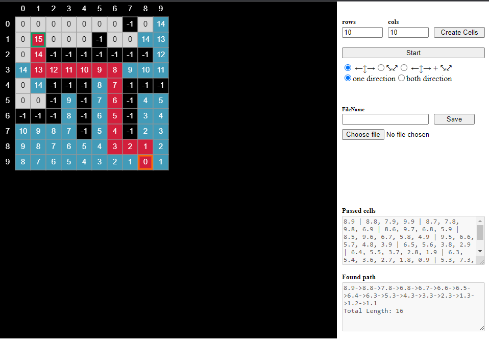

# Description
Processing p5.js app for Lee algorithm: maze path finding algorithm. Provides an interface for maze building and defining parameters for path finding. 
Wall/Road are set with click. Start/Finish are set with ctrl+click.

File loading needs to be improved.
Bug could occur: despite representation on picture, cell could have another type (wall/road).
Animation need to be optimized (for big mazes takes long time for one frame displaying).

